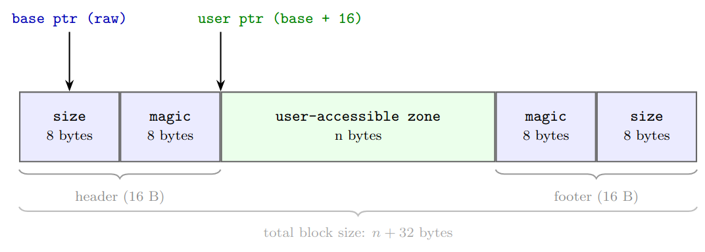
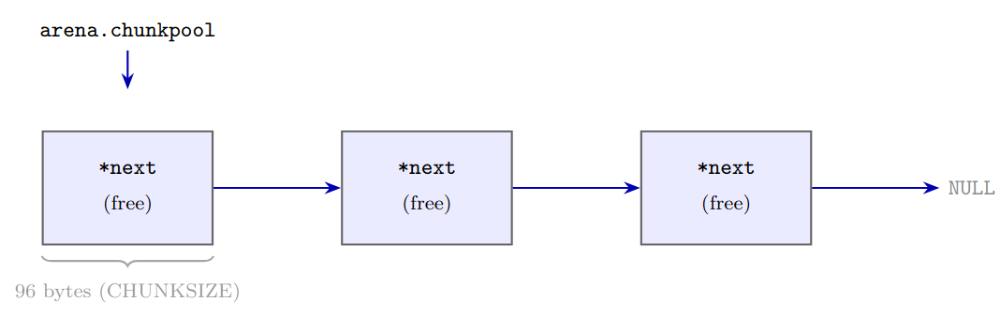

# Virtual Memory Allocator: Design and Implementation

## Overview

This project implements `emalloc(size)` and `efree(ptr)`, functionally equivalent to the standard `malloc` / `free`. The allocator operates on virtual memory using `mmap` and `munmap` and splits requests into three size classes:

- Small : `size <= 64` bytes
- Medium : `64 < size < 131072` bytes ($2^{17}$)
- Large : `size >= 131072` bytes

`emalloc` dispatches to the appropriate sub-allocator based on a threshold check.
`efree` reads the block's embedded metadata to determine which sub-allocator handles the deallocation.

---

## 1. Block Marking

Every allocated block, regardless of size class, carries metadata at both ends.

### Layout



The user pointer returned by `emalloc` is `base + 16`. The `size` field stores the **total** block size (user data plus 32 bytes of overhead). For small allocations, this total is always `CHUNKSIZE = 96` bytes.

### Magic Value

The `magic` word is derived from the block's base address using the Knuth MMIX linear congruential generator. The two least significant bits encode the allocation kind: SMALL = 0, MEDIUM = 1, LARGE = 2.

$$\text{magic} = \bigl(\text{MMIX}(\text{base}) \;\&\sim 3\bigr) \mid \text{kind}$$

The magic is therefore unique per block address and carries the allocation type, making accidental matches from arbitrary memory contents highly improbable.

### Overflow Detection

The double marking (header and footer) enables two integrity checks in `efree`:

1. Re-derive the expected magic from the base address and compare it to the stored header magic. A mismatch indicates corruption **before** the user zone.
2. Compare the footer against the header. A mismatch indicates a write **past**    the end of the user zone, i.e. a buffer overflow.

This is why the system `free()` often crashes at the call site even though the overflow happened earlier: `free` is the first point where the corruption is checked.

## 2. Large Allocations

Each large block gets its own `mmap` call and is returned to the OS via `munmap` on free. There is no reuse. The overhead of two system calls is negligible relative to the allocation size, and the simplicity is worth it.

## 3. Small Allocations: Fixed-Size Pool

All allocations of 64 bytes or less are served from chunks of exactly `CHUNKSIZE = 96` bytes. The exact requested size is ignored: every small allocation consumes one full chunk.

### Structure

The pool is a singly linked list. The first 8 bytes of each free chunk store the pointer to the next free chunk. The list head is `arena.chunkpool`.



**Allocation:** pop the head, write the block markers, return `head + 16`.

**Free:** push the raw base address back onto the head. No system call.

### Refill and Recursive Doubling

When the pool is empty, `mem_realloc_small()` maps a new region whose size doubles with each refill:

$$\text{size}_k = \text{FIRST\_ALLOC\_SMALL} \times 2^k$$

where $k$ is `arena.small_next_exponant`. The new region is then sliced into `CHUNKSIZE`-byte slots and chained in a single pass. This doubling strategy amortises the cost of `mmap` over all subsequent allocations, keeping the average cost $O(1)$.

## 4. Medium Allocations: Buddy Algorithm

The buddy (binary subdivision) system is used for allocations between 64 bytes and 128 KiB. The Linux kernel uses the same algorithm for its physical page allocator.

### Table of Free Zones (TZL)

`arena.TZL` is an array of free-list heads indexed by the base-2 logarithm of the block size: `TZL[i]` holds free blocks of size $2^i$. Free blocks store their next pointer in their first 8 bytes, as in the small pool. 
The minimum populated index is `FIRST_ALLOC_MEDIUM_EXPOSANT = 17` ($2^{17}$ = 128 KiB).

### Allocation

1. Compute the target index $k$: the smallest $k$ such that $2^k \ge \text{size} + 32$.
2. Scan `TZL[k], TZL[k+1], ...` for the first non-empty entry at index $f$.
3. If none found, call `mem_realloc_medium()` to obtain a new aligned block.
4. Pop the block from `TZL[f]`. While $f > k$: split the block in half, push the upper half into `TZL[f-1]`, keep the lower half, decrement $f$.
5. Mark the block and return the user pointer.

### Free and Coalescing

Given a block at address $a$ of size $s = 2^k$, its buddy address is:

$$\text{buddy} = a \oplus s$$

The XOR works because blocks are aligned to their size: the bit at position $k$ is the only difference between the two halves of a split block.

To free:
1. Compute the buddy address.
2. Walk `TZL[k]` to find the buddy.
3. If not present: insert the block into `TZL[k]`, done.
4. If present: remove the buddy, merge the pair into a block of size $2^{k+1}$ at address $\min(a, \text{buddy})$, increment $k$, and repeat from step 1.

Coalescing is the key advantage of the buddy system: it actively reconstructs large contiguous free regions after frees, preventing the allocator from accumulating small unusable holes over time.

### Alignment

The XOR trick requires each block of size $s$ to start at an address that is a multiple of $s$. `mem_realloc_medium()` enforces this by mapping $2s$ bytes and advancing the pointer to the next $s$-aligned boundary within that region.

---

## 5. Memory Arena

All allocator state lives in a single global structure `MemArena arena`:

```c
typedef struct {
    void *chunkpool;             // small pool list head
    void *TZL[TZL_SIZE];         // buddy free lists, indexed by power of two
    int   small_next_exponant;   // doubling counter for small refills
    int   medium_next_exponant;  // doubling counter for medium refills
} MemArena;
```

Centralising state in one struct has a practical consequence for thread safety: protecting the arena is sufficient to protect all allocator state.

## 6. Thread Safety

The default single-arena design is not thread-safe. Concurrent calls to `emalloc` or `efree` would corrupt the linked lists and the TZL.

### Mutex-based solution (implemented)

A single POSIX mutex with static initialisation protects the arena:

```c
static pthread_mutex_t arena_lock = PTHREAD_MUTEX_INITIALIZER;
```

Every `emalloc` and `efree` acquires the mutex, does its work, and releases it. This guarantees correctness and allows cross-thread frees (a block allocated by thread A can be freed by thread B). The cost is serialisation: at high thread counts, all threads queue on the same lock, so throughput does not scale.

### Scaling further

Production allocators (jemalloc, tcmalloc) maintain a pool of arenas proportional to the number of CPU cores and assign threads to arenas at creation time. This reduces contention without sacrificing the ability to handle cross-thread frees.


## Summary

| Size class | Mechanism           | System call cost           | Complexity             |
|------------|---------------------|----------------------------|------------------------|
| Large      | `mmap` per block    | every alloc and free       | $O(1)$                 |
| Small      | Fixed-size pool     | amortised (doubling)       | $O(1)$                 |
| Medium     | Buddy / TZL         | amortised (doubling)       | $O(\log n)$            |

The marking layer adds a fixed 32-byte overhead to every block and imposes no runtime cost during normal operation. Its checks fire only in `efree`, and only when memory corruption has already occurred.
